## Single-Machine Test (All-In-One-Box)
We have prepared the configuration files in ```configs``` folder, these configuration files will be used to launch 3 replicas, 1 proxy and 1 client.

- nezha-replica-config-0.yaml 
- nezha-replica-config-1.yaml
- nezha-replica-config-2.yaml
- nezha-proxy-config.yaml
- nezha-client-config.yaml

### View Change Test
**Step 1**: Launch 3 replicas (i.e. replica-0, replica-1, replica-2). Open 3 terminals and launch one replica in each terminal.
```
# In the first terminal
$HOME/nezhav2/bazel-bin/replica/nezha_replica --config $HOME/nezhav2/configs/nezha-replica-config-0.yaml

# In the second terminal
$HOME/nezhav2/bazel-bin/replica/nezha_replica --config $HOME/nezhav2/configs/nezha-replica-config-1.yaml

# In the third terminal
$HOME/nezhav2/bazel-bin/replica/nezha_replica --config $HOME/nezhav2/configs/nezha-replica-config-2.yaml

```

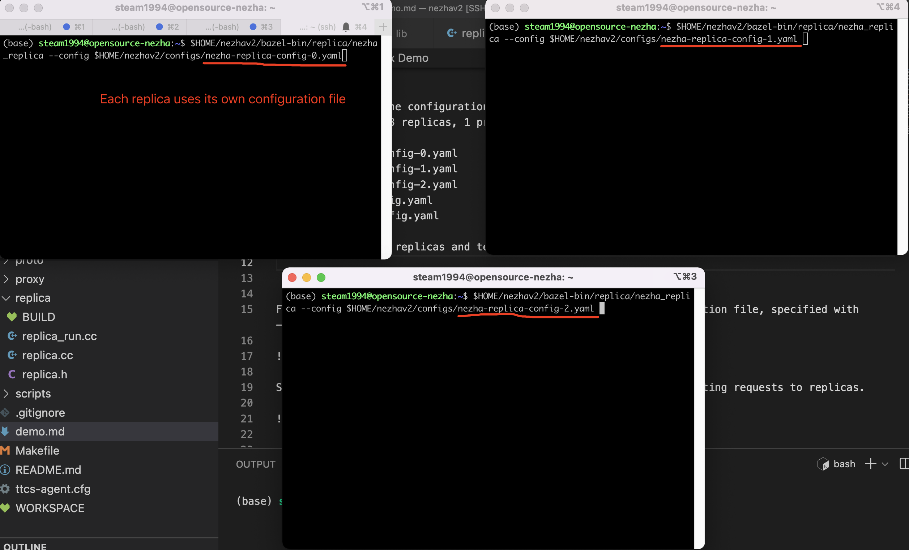

**Step 2**: After the three replicas are launched, we can see the important information displayed from the console logs, e.g. the current view, the replica id of this replica, the number of replicas, the number of keys the maintained by each replica's state machine (for commutativity optimization)
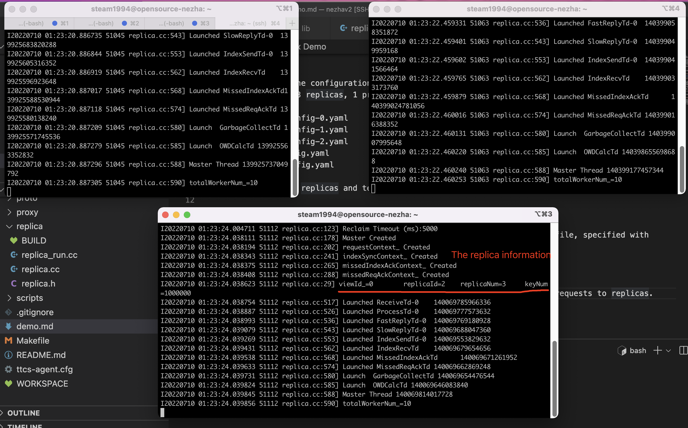

**Step 3**: In view 0, the leader replica is ```viewId%replicaNum=0```, i.e. replica-0. Therefore, if we kill replica-0, we will trigger view change, so we use Crtl+C to kill replica-0
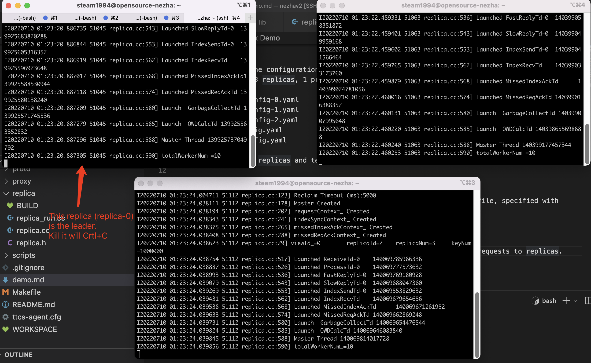


**Step 4**: After leader is killed, the remaining 2 replicas start view change to enter a new view, i.e., view 1. In this new view, the leader becomes ```viewId%replicaNum=1```, i.e., replica-1. Since there are still a majority of replicas (i.e., 2 replicas) alive, the system can resume service.
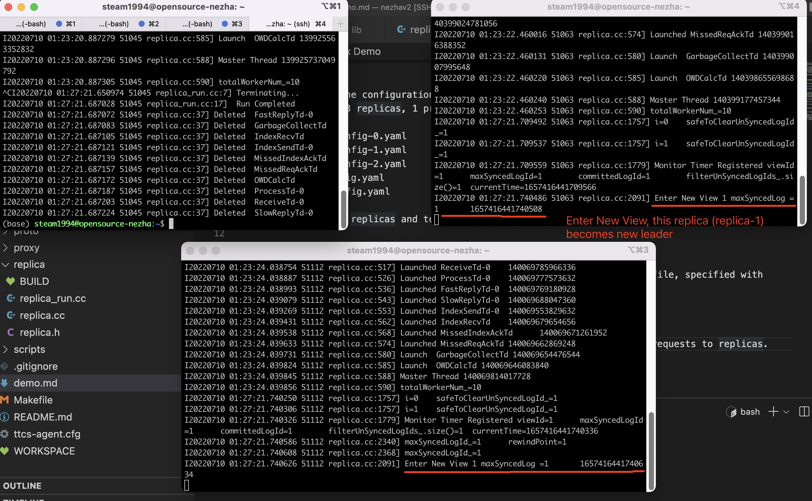

**Step 5**: We want the failed replica to rejoin the system. Therefore, we launch replica-0. This time, we set the flag ```isRecovering``` as true, so that it goes through the recovery procedure and retrieves the state from the other healthy replicas.
```
# In the first terminal 
$HOME/nezhav2/bazel-bin/replica/nezha_replica --config $HOME/nezhav2/configs/nezha-replica-config-0.yaml --isRecovering true
```

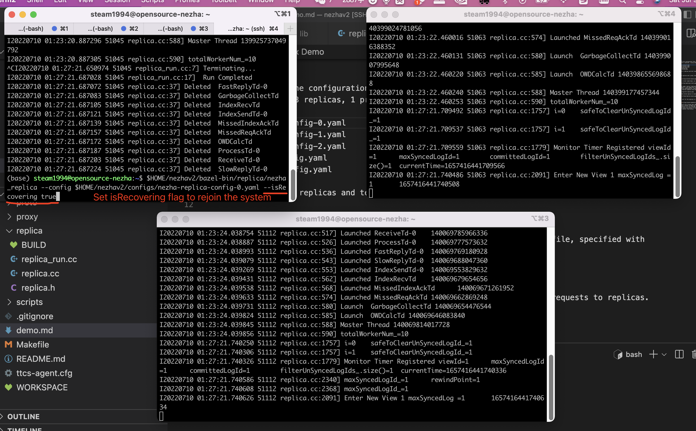

**Step 6**: We can see that replica-0 rejoins the system as a follower, and the current view is 1.
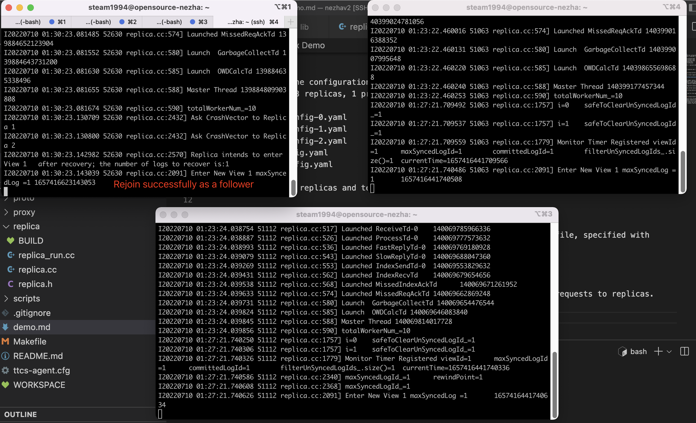


The test process can be repeated. So long as there are always a majority of replicas (f+1) remaining, then the system is able to serve clients and failed replicas can also rejoin. 

### Test with Client

**Step 1**: Similar to the previous section, we launch 3 replicas. More than that, this time we also launch 1 proxy and 1 client. In the client configuration file (i.e. [nezha-client-config.yaml](configs/nezha-client-config.yaml) ), we have specified the client as an open-loop client, and it will submit at about 1000 requests/second.
```
is-openloop: true
poisson-rate: 10
```

```
# In the first terminal
$HOME/nezhav2/bazel-bin/replica/nezha_replica --config $HOME/nezhav2/configs/nezha-replica-config-0.yaml

# In the second terminal
$HOME/nezhav2/bazel-bin/replica/nezha_replica --config $HOME/nezhav2/configs/nezha-replica-config-1.yaml

# In the third terminal
$HOME/nezhav2/bazel-bin/replica/nezha_replica --config $HOME/nezhav2/configs/nezha-replica-config-2.yaml

# In the fourth terminal
$HOME/nezhav2/bazel-bin/proxy/nezha_proxy --config $HOME/nezhav2/configs/local/nezha-proxy-config.yaml

# In the fifth terminal
$HOME/nezhav2/bazel-bin/client/nezha_client  --config $HOME/nezhav2/configs/nezha-client-config.yaml

```


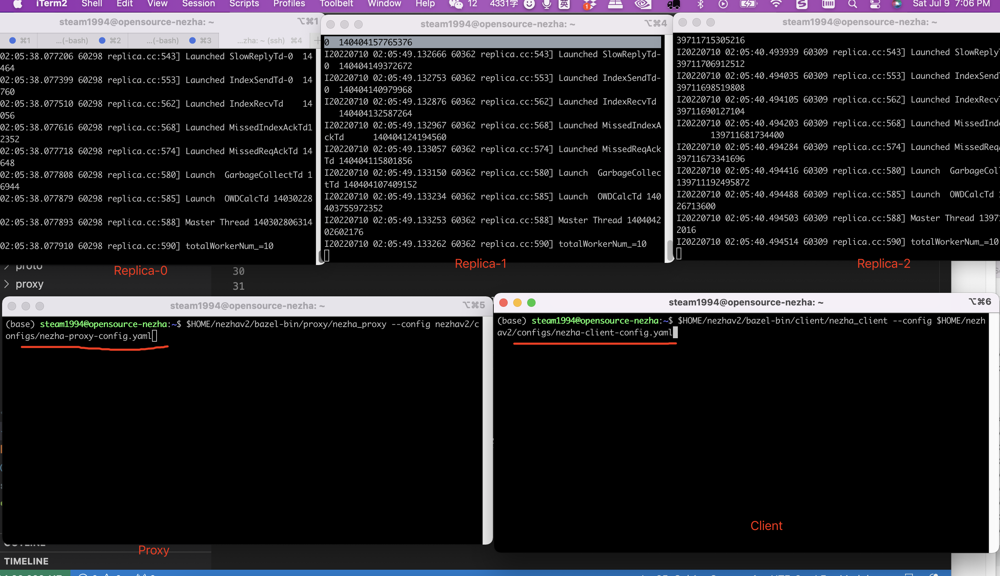


**Step 2**: After the client is launched, we can see it continues to submit requests and the proxy continues to forward requests for the client. For every 5 seconds, the client terminal will print a log to show the stats.
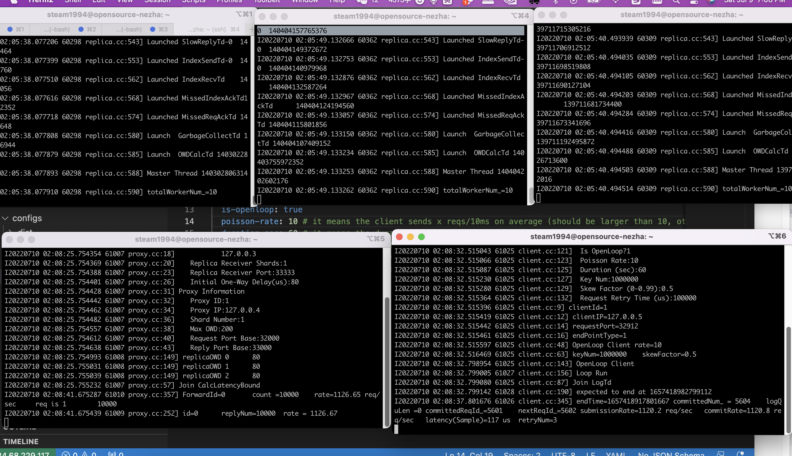

**Step 3**: While the client is submitting requests, we kill the leader (i.e. replica-0), we can see that the remaining 2 replicas rapidly complete the view change and get the new leader, which takes about ```1657418951138477-1657418950947251=191226us=191ms```. It can complete the view change so fast, because of the optimization of periodical synchronization (which has been explained in our paper). Because of the periodical synchronization, the new leader replica does not need to do state transfer from scratch, it just needs to do state transfer and log merge from the last commit point. 
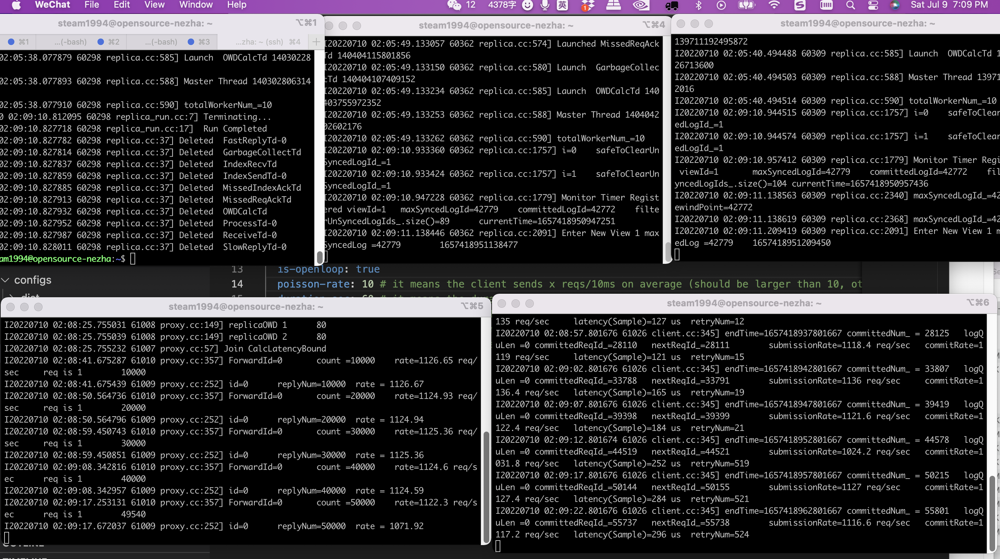


**Step 4**: We want the crashed replica (i.e. replica-0) to rejoin the system. So we set ```isRecovering``` flag as true. 

```
# In the first terminal
$HOME/nezhav2/bazel-bin/replica/nezha_replica --config $HOME/nezhav2/configs/nezha-replica-config-0.yaml --isRecovering true
```

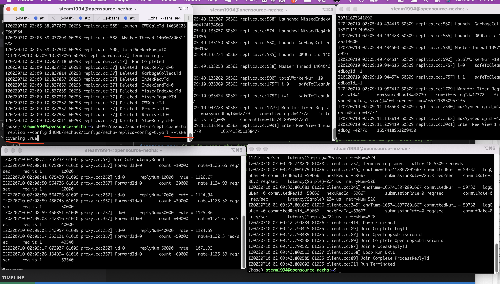


**Step 5**: The crashed replica starts from an empty state, so it needs to retrieve all the log entries in order to recover, which takes some time. As shown in the terminal of replica-0, we also print the progress of the recovery. But note that the follower's recovery does not block the other healthy replicas from serving the client. An optional optimization in consideration is to generate snapshot periodically and dump to stable storage. In this way, when a crashed replica wants to recover, it first fetches the state from local storage, and then does state transfer. In this way, it can save the recovery time. 
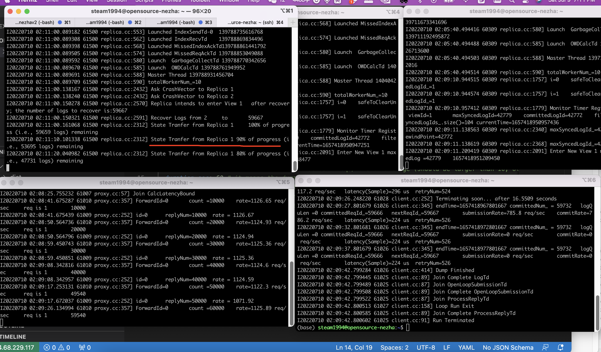


**Step 6**: After replica-0 retrieves all the state, we can see it successfully recovers and work as a follower.
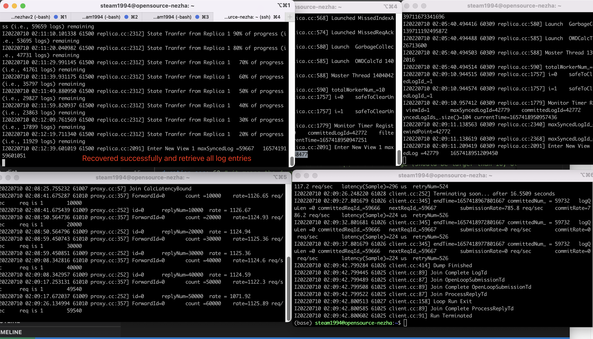