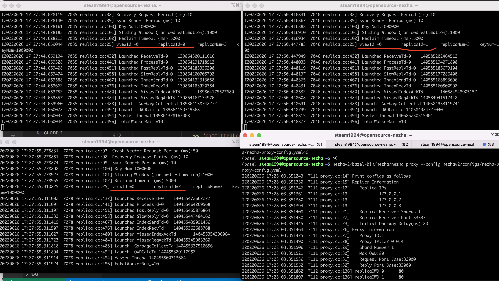
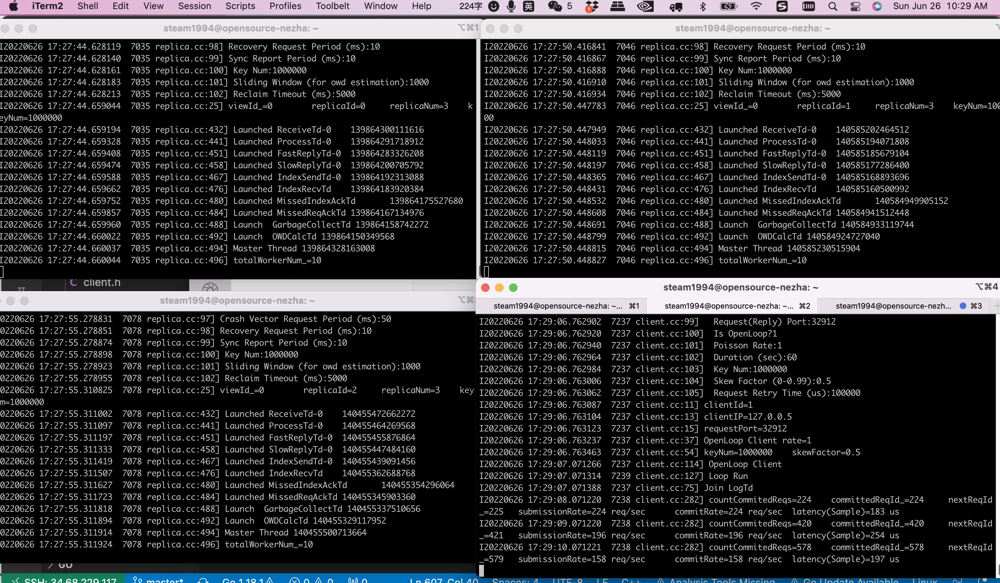
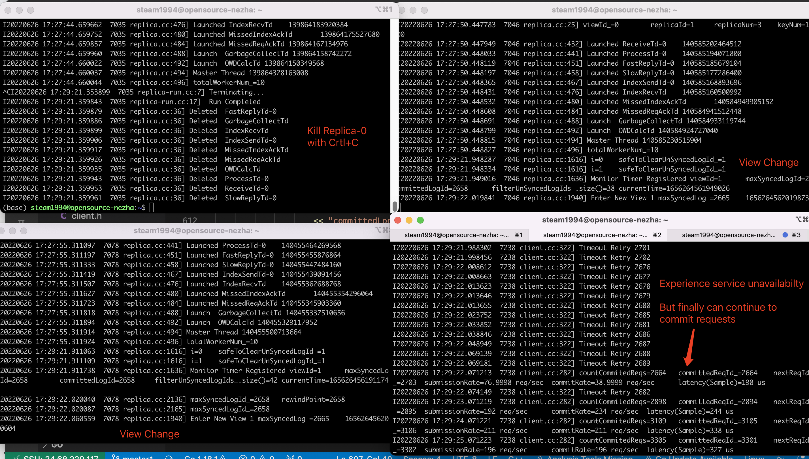
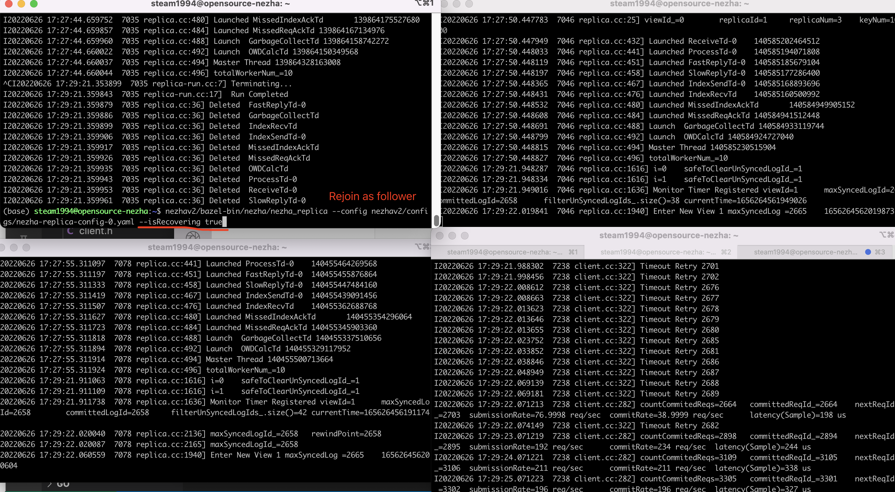
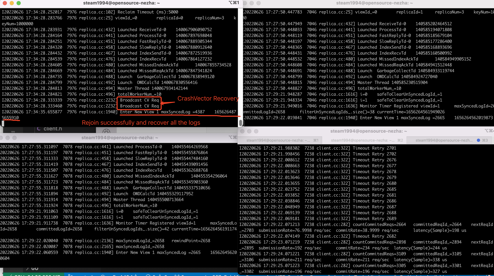

## One-Box Demo
First, launch 3 replicas and 1 proxy. Each one has its own configuration file, specified with --config

Second, launch 1 client (open-loop), we can see the client is committing requests to replicas.

Third, kill the leader replica (replica-0) with Crtl+C, then we can see (1) the other two replicas will start a view change and finally enter the new view (view-1) (2) the client experiences service unavailability (cannot commit requests), but finally can continue to commit requests after replicas complete view change.

Last, we want the killed replica to rejoin the system, so we specify the flag --isRecovering true.

Note: The time cost for the replicas to rejoin the system depends on how many logs have been committed. 

In this demo, there have already been 4387 logs committed, the rejoining replica needs to complete the state transfer of 4387 logs before it can recover, which may take several seconds. A possible optimization is to let replicas periodically dump snapshots to disk. In this way, when a crashed replica rejoin the system, it can first recover some state from the local disk, instead of doing state transfer from scratch.